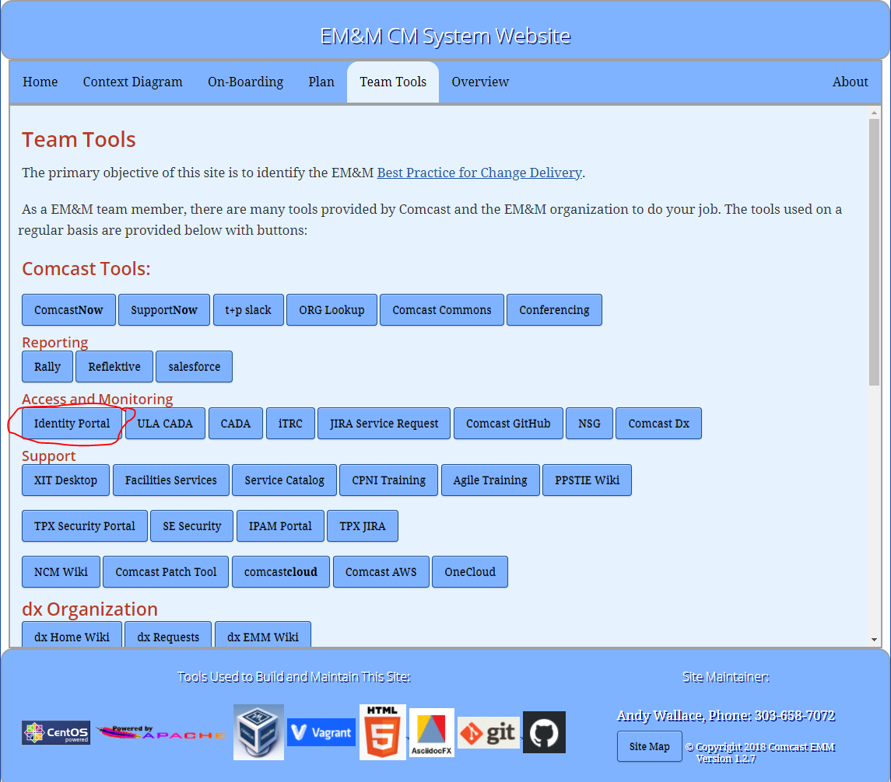

:toc: macro
toc::[left]

:hardbreaks::

== Git Installation Procedure

=== Prerequisites

* Comcast workstation/laptop with Windows 10 or 7 or Mac
* Comcast NTLogon with admin access on workstation
* Each EM&M user of Comcast Enterprise GitHub needs to install Git per this procedure.

The intended audience for this overview is any member of the EM&M organization. This document sets the stage for all EM&M Git related processes, procedures, and documentation.

[NOTE]
====
. This Git installation is recommended by the http://git-scm.com[Git SCM] site for http://git-scm.com/book/en/Getting-Started-Installing-Git#Installing-on-Windows[Windows Installations]. The http://git-scm.com[Git SCM] site also supports other commonly used Operating Systems. Since the EM&M Analyst primary workstation is Windows 7 or Windows 10, this is the preferred and recommended approach using openSSH.
. There is also an ssh client you can use in place of putty. It is available from the https://wiki.sys.comcast.net/pages/viewpage.action?pageId=48759751[CM Wiki] under Standards & Policies -> Access, called https://wiki.sys.comcast.net/download/attachments/71944374/SSHSecureShellClient-3.2.9.exe?api=v2[SSHSecureShellClient-3.2.9.exe]. Install it on your workstation with the indicated defaults.
. The mac environments have a native ssh client.
. For none windows systems, follow the Git installation instructions for the appropriate operating system. The remainder of this document can be used for any unix or linux environment.
. For release notes, reference file:///C:/Program%20Files/Git/ReleaseNotes.html. You'll need to cut and paste this link into your browser address window after you complete the git installation. It is a link to your workstation.
====

=== Installing Git

.  go to link http://git-scm.com/[git-scm]. Depending on your workstation, you will see a section on this page that looks like one of the following image:

* For mac install:
** You may need to hold down the control key whne clicking on the pkg script.
** Run git command line in the native xterm under "Other" apps.

* For Windows install:
** All defaults with following considerations:
*** The Vim editor is the default editor. Nano, Notepad++, and VisualStudioCode are other options.
*** "Use Git and optional Unix tools from the Windows Command Prompt" is recommended
*** "Use the OpenSSL library" is recommended
*** "Checkout Windows-style, commit Unix-style line endings" is recommended
*** "Use MinTTY (the default terminal of MSYS2)" is recommended
*** Following is recommended:
**** "Enable file system caching"
**** "Enable Git Credential Manager"
*** Following is *NOT* recommended:
**** "Enable symbolic links"

== Upgrade Git

follow the same steps for installating Git. It is designed to install over an existing installation. Note the expected version release change after you are done.

=== Initial git Configurations

After you have installed Git successfully, you have full Git functionality on your workstation.

[green]#Be sure to use the Git Bash session you just installed for the following sections.#

Try the following commands in your Git Bash window:

Run '**git help git**' to display the help index in a browser window.
Run '**git help <command>**' to display help for specific commands in a browser window.

.In order to interface with the Comcast Enterprise https://github.comcast.com/[GitHub] system, the following needs to be performed:
* Identify or Set $HOME variable on your Workstation.
* Build and Configure SSH key Usage
* Identify yourself in Git:
** Name
** email
** Setup your default editor
** Setup the diff tool you will use
* Add SSH Aliases
* Verify Git remote "origin"

[NOTE]
====
The above bullets are covered in http://git-scm.com/book/en/Getting-Started-First-Time-Git-Setup[First-Time Git setup]. You may also find the GitHub Help page https://help.github.com/articles/set-up-git/[Set Up Git] useful.
====

The following sections cover required and recommended configurations.

=== Identify Yourself in Git

.Enter your first and last name:
* $ git config --global user.name "Andy Wallace"

.Enter your Comcast email address:
* $ git config --global user.email Andrew_Wallace@cable.comcast.com

.Setup your editor:
* $ git config --global core.editor vim

.Setup you diff tool:
* $ git config --global merge.tool vimdiff

.You can run the following command to see all of your Git settings:
* $ git config --list

[TIP]
====
.Verify the following values have been configured:
. user.name
. user.email
. core.editor
. merge.tool
====

For windows, verify your git workarea(s) on your windows workstation are on the C Drive in your home directory.

[source asciidoc]
----
$ (current directory)
$ cd ~/
$ Andy@Office-PC MING@64 ~
$ pwd
/c/Users/Andy
$
----

=== Identify the $HOME variable on Your Workstation

.Mac instructions:
. $HOME should be defined already

.Windows 7 specific instructions:
. Click on Start (Lower Right Windows Bubble)
. Right Click on *Computer* and select *Properties*

.Windows 10 specific instructions:
. Right Click Windows pane (lower right) and select "System"

.Common to Window 7 and Windows 10
. Select *Advanced system settings*
. Click on the *Environment Variables...* button on the "Advanced" tab of the System Properties window for Windows 7
. Verify there is a *HOME* variable in the *System variables* list. This variable is referenced by SSH when supporting remote functionality.
.. Should be set to C:\Users\[your NTLogon].
.. Create (New button) or adjust (edit button) the *HOME* system variable accordingly.

=== Build and Configure SSH key Usage

You can reference http://git-scm.com/book/en/v2/Git-on-the-Server-Generating-Your-SSH-Public-Key[Generating Your SSH Public Key] for more details on the following instructions.

.Execute the following in your new Git Bash window.
* $ ls -la ~/

.If your do not have a ~/.ssh directory, create it:
* $ mkdir c:\Users\awalla5075k\.ssh (Substitute your NTlogon for awalla5075k)

[WARNING]
====
*Use the Git Bash window. Windows Explorer will not allow you to create the .ssh directory.*)
====

$ cd ~/.ssh  (c:\Users\awalla5075k\.ssh)

* Set the ~/.ssh permissions to 740 *($ chmod -R 740 ~/.ssh)*
* Set the file permissions in ~/.ssh to 740 *(Just verify, should be done from previous step.)*

[NOTE]
====
Note the "~/" utilizes the workstation system *HOME* variable for your NTLogon.
====

.Generate ssh key pair using your NTLogon:
* $ ssh-keygen -t rsa -f [Your NTLogon] (NTLogon is all lower-case, no mixed case.)

[IMPORTANT]
====
It is recommended you enter nothing for the pass phrase.
====

.The following two files will be generated:
* *[Your NTLogon]* -  Your *[red]#private#* key file
* *[Your NTLogon].pub* -  Your *[green]#public#* key file

[WARNING]
====
*Never send your private key in an email or attach it to a JIRA ticket.*
====

[IMPORTANT]
====
*If you have not yet logged onto the* https://github.comcast.com/[Comcast Enterprise GitHub] *system, you'll need to follow the instructions in the* _**Comcast Enterprise GitHub**_ *section of this document to establish your account. Then return back to this location to continue configuration and testing.*

Refer to the _Comcast Enterprise GitHub_ section of this document for instructions. Once you have your GitHub account, return here and continue.

Your interaction with the EM&M GitHub managed remote repos will be more secure using your ssh key.
====

.Setup your ssh Key on GitHub
. Logon to Comcast Enterprise https://github.comcast.com/[GitHub]
. On upper-right of window select pulldown for _**View Profile and more**_
. Select Settings
. Under _**Personal settings**_ select _**SSH keys and GPG keys**_
. Click on the _**New SSH key**_ button and follow instructions.

For more information about EM&M SSH key pairs, refer to the EM&M https://wiki.sys.comcast.net/display/EMM/SSH+Key+Usage+Policy[SSH Key Usage Policy].

.Verify your git workarea(s) on your windows workstation are on the C Drive.
[source,asciidoc]
----
$ awalla5075k@CO183LCETENG08 /h
$ cd ~/ (or cd $HOME)
$ awalla5075k@CO183LCETENG08 ~
$ pwd
/c/Users/awalla5075k
$
----

=== Add SSH Aliases

To reduce typing and minimize ssh key issues, the following is done to provide ssh aliases for the EMM Git System servers. Add a config file under the \~/.ssh on your workstation for your NTLogon as follows.

Edit (or create) ~/.ssh/config and add the following lines adjusted for your [blue]#NTLogon#:

$ vim ~/.ssh/config

[source,text]
----

################################################################
################################################################
### EMM GitHub SSH Client Config file                        ###
###                                                          ###
### This code block required for general EMM GitHub Access.  ###
###                                                          ###
### Place this code block in file ~/.ssh/config on your      ###
### workstation. If ~/.ssh/config already exists, add        ###
### this code block to file ~/.ssh/config.                   ###
###                                                          ###
### DISCLAIMER:                                              ###
###    This code block not designed to work with wildcard    ###
###    definition for Host (Host *) in the ~/.ssh/config     ###
###    file.                                                 ###
###                                                          ###
### Host cghi is Comcast GitHub Interface, the alias that    ###
### will be used for the GitHub remote.                      ###
###                                                          ###
### Syntax format                                            ###
###                                                          ###
### Host [ssh alias names]                                   ###
###        User [host user name]                             ###
###        Hostname [host dns]                               ###
###        Port 22                                           ###
###        IdentityFile ~/.ssh/[Your NTLogon]                ###
################################################################
#                                                            ###
# Host ghe GHE cghi CGHI                                     ###
#         User git                                           ###
#         Hostname github.comcast.com                        ###
#         Port 22                                            ###
#         IdentityFile ~/.ssh/"Your NTLogon"                 ###
#                                                            ###
################################################################

----

This file allows you to enter commands like this:
$ git clone ghe:EMM/CM-System-Site
Rather than this:
$ git clone ssh://git@github.comcast.com/EMM/CM-System-Site

*You should now have three files similar to the following in your ~/.ssh directory:*

[source,asciidoc]
----
awalla5075k@CO183LCETENG08 ~/.ssh
$ ls -la
total 20
drwxr-xr-x   15 awalla50 Administ     4096 Dec  2 10:14 .
drwxr-xr-x    1 awalla50 Administ    12288 Feb 17 12:12 ..
-rw-r--r--    1 awalla50 Administ     1679 Dec  2 10:12 awalla5075k
-rw-r--r--    1 awalla50 Administ      408 Dec  2 10:12 awalla5075k.pub
-rw-r--r--    1 awalla50 Administ     1749 Jul 17  2014 config

awalla5075k@CO183LCETENG08 ~/.ssh
$
----

[TIP]
====
Be sure to read all comments whenever you enter git commands. They usually contain some indication of what you need to enter next.
====

== Comcast Enterprise GitHub

If you have not logged onto before, click on the following indicated button. Then following instructions below: 

* Click on the access button
* Click on the Request for Self button
* Select on the "Applications" tab (from "current" tab)
* Select Github Enterprise
* Click on the "+":
** You'll need to agree to all the Comcast GitHub Enterprise (GHE) policy usage statements
** and add yourself - Business Justification - "EM&M Organization contributing Team Member".

[NOTE]
====
* Once you can log onto Comcast Enterprise https://github.comcast.com[GitHub] successfully, your userid will be available for the On-boarding configuration to your EM&M Tower GitHub organization.
* For On-boarding details, reference the EM&M https://wiki.sys.comcast.net/pages/viewpage.action?spaceKey=EMM&title=On-Boarding[On-Boarding] wiki page.
====

Once your userid as been associated with an EM&M GHE organization, mimic the following on your workstation in your new Git Bash Session:

image::images/initial-clone-repo.png[]

Now you have established a git repo local on your workstation from the Comcast Enterprise Github EMM organization. You can verify the git remote origin in the local copy on your workstation.

The git remote `origin` should be setup for communication between your workstation repo and the Comcast Enterprise GitHub EM&M organization EMM. Reference http://gitref.org/remotes/#remote[git remote] for more details.

image::images/show-origin-remote.png[]

If you are unable to mimic the above Git bash sessions on your workstation, review the *_Add SSH Aliases_* section of this document. If you are still having issues, check with your EM&M Tower leadership.

== EM&M Git Introduction

If you are new to Git, refer to the following links:
* https://git-scm.com/doc
* https://www.youtube.com/user/github/videos

== EM&M and Comcast Enterprise GitHub

There are two protected main branches in all EM&M GitHub repos, _**develop**_, and _**master**_. Reference http://nvie.com/posts/a-successful-git-branching-model/[a successful-git-branching-model] for details.

.To update the _**develop**_ or _**master**_ branch, GitHub pull requests are required and need to be done by devleads. This initiates a colaborative code review session. To do this:
. git push the branch you wish to merge
. Do a GitHub pull request. Reference *"Show me how"* at https://services.github.com/on-demand/github-desktop/push-pull-request-github-desktop[Push to Github & Create a Pull Request] for a specific example.
. Click on pull request and add reviewers
. Review and address comments from reviewers
. Merge pull request

== Git Conflict Reporting

Reporting on git merge conflicts before actually doing a merge provides a view into additional deltas that need to be considered before doing a merge.

A script tool, *report-conflicts.bsh* has been prepared by EM&M CM for EM&M DevOps personnel to identify all conflicts to all main, and outstanding release branches for a given feature branch.
[TIP]
====
Reference the *EM&M Branching and Merging Workflow* section of the EM&M Git http://emmutl-ch2-1p.sys.comcast.net/git/user-guide.pdf[User Guide].
====

The *report-conflicts.bsh* is designed to be run from any EM&M DevOps contributor's workstation or laptop.

If you are are having any issues, check with your EM&M Tower leadership.

.Installation Instructions
. Create a "bin" directory under your ~/ directory
. Add C:\Users\awalla5075k\bin to your workstation or laptop User Variable Path. Substitute your NTLogon for awalla5075k.
. Get local to your new bin directory and install the report-conflicts.bsh script to it.
* cd ~/bin
* cp ~/git-repos/CFX-EMM-SYS-Git/app/bin/report-conflicts.bsh .
. Setup directories to be used only by the report-conflicts.bsh.
* mkdir ~/git-repos/conflict-reports
* mkdir ~/git-repos/conflict-reports/log
. Open the script report-conflicts.bsh with vim and set the RepoHome variable to "/c/Users/awalla5075k/git-repos/conflict-reports" substituting your NTLogon for awalla5075k.
. Execute the following for execution instructions:
* report-conflicts.bsh -h

[NOTE]
====
. Reference the *"Identify the $HOME variable on Your Workstation"* to get you to the "Environments Variables" window to update your User Variable *Path*.
. You can install the report-conflicts.bsh script from GitHub EMM org repo directory CM-System-Site/app/bin. 
====
