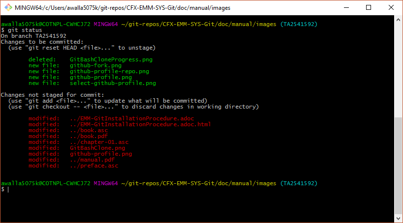
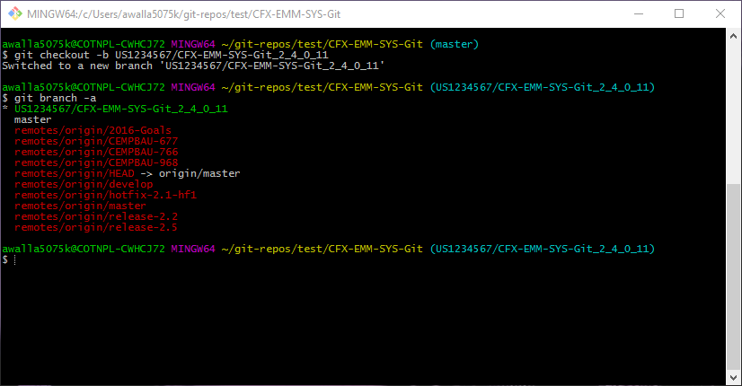
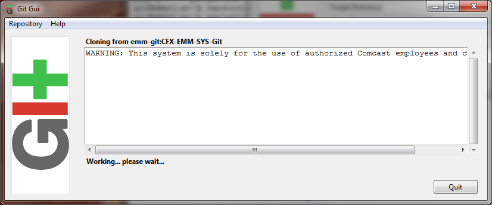

:toc: macro
toc::[left]

[index]

= Overview

This guide presents git usage per the GitFork workflow.

*Tips*
[TIP]
====
* https://www.atlassian.com/git/tutorials/comparing-workflows/forking-workflow[Forking Workflow] - Substitute *GitHub* for *Bitbucket* when reading this. Good explaination of this workflow.
* https://guides.github.com/activities/forking/[Forking Projects] a good introduction to GitHub forking.
* https://reflectoring.io/github-fork-and-pull/[Fork and Pull Workflow for Git Beginners]
====

Company repositories (repos) are usually managed using the Enterprise https://github.com/[GitHub] system. It is based on the http://en.wikipedia.org/wiki/Git_(software)[Git] tool. Refer to http://git-scm.com/about[About Git] for more information on the Git tool.

GitHub should be configured for company usage to use standard GitHub functionality to support collaboration. Specifically the GitHub access for organizations and repos, https://help.github.com/articles/fork-a-repo/[GitHub fork] and https://help.github.com/articles/creating-a-pull-request/[pull request] functionality.

[NOTE]
====
The above links point to general open-source GitHub documentation. Company GitHub Enterprise is accessed with company specific access management. **Do not use company generated SSH keys to access the general open-source GitHub system.**
====

*(Introduce MDP process/approach here)*

= New to Git?
If you are new to Git, watch the videos at https://www.git-scm.com/doc[Git Documentation]. The time required is less than 30 minutes. It's a great investment of your time.

The GitHub repos and access are configured to use Github fork and Pull functionality. GitHub pull requests are required for the main branches.

This rest of this overview section covers the following:

* Identifies the *Prerequisites* that need to be addressed.
* Provides *Notes* on issues that have caused questions as this system has been rolled out and used.
* Outlines a typical *General Session* you are likely to encounter as you use and interact with the EM&M Git System.

= Prerequisites

Refer to company on-boarding documentation.

== Notes

. Identify Module/Repo naming standards
. You will need Write permission to be able to `Git push` to the remote (GitHub repo) *master*, *hotfix*, *release*, or *develop* branches. If you incorporate GitHub fork functionality, you can use GitHub "pull request" functionality with your team. Check with your development lead for more details on this.
. Code reviews are required for all merges to develop and master branches. This is done with the *New pull request* button on the GitHub repository home page.
. You must be a *developer lead* to `Git push`  to the remote GitHub repo *develop* and *master* branches.
. Note that a git tag that starts with *v[0-9]* is reserved for EM&M Production Releases. Reference the Release Branches section of this guide for details.
. For any git command, you can enter git [_command_] -h for command specific documentation.
. EM&M GitHub organization repo branch and tag access rules are configured and maintained at the GitHub organization level. Check with your EM&M Tower for details.
. Can't _git checkout_ to a new or different branch? Reference http://git-scm.com/book/en/v2/Git-Tools-Stashing-and-Cleaning[Stashing and Cleaning].
. Use *gitk* on your window git bash session for a good GUI of your current _**local**_ repo branching and merging picture.

= General Session

As development and unit testing occurs, most interaction with git will be through your local git repo on an isolated branch. The only times you will interact with the GitHub organizations will be when you:

. Request a new repo for addition to the Enterprise GitHub organization.
. GitHub fork a repo from the GitHub organization to your github profile. Then "git clone" that repo to your workstation.
.. Add an additional "git remote" to your cloned repo for the organization repo you forked from.
.. Write permissions on the organization repo is limited to support code reviews and CI/CD automation. 
. Using the git pull and push commands to your GitHub forked repos and repos you forked from.

Before you do any `git commit` on your local git repo, you need to:

. Fork the repo to be worked on to your GitHub account
. Establish a workstation local repo (`git clone` from your GitHub forked repo)
. Establish an additional git remote in your workstation local repo for the repo you forked from.
. Identify available branches on local repo (`git branch`  -a)
. Establish working directory with appropriate branch head (`git checkout`  [_branch name_])
. Create new branch to code on (`git checkout`  -b [_new branch_])
. Update and/or establish .gitignore file. It Specifies intentionally untracked files to ignore.

= GitHub and Git Interfaces

When you followed the Git Installation Procedure previously for your workstation, the recommended Git Bash Command line Interface (CLI) and the Git Graphical User Interface (GUI) for your workstation were both installed.

Before using git locally on your system, you'll need to logon to your GitHub profile and select a repo:

image::images/github-profile.png[]

Fork the selected repo into your local github profile:

image::images/github-fork.png[]

== Delivery

Now you have a profile repo forked to your local profile. You will deliver your updates to this repo after you worked and tested them on the workstation repo you cloned from this repo. If you have Write permissions on the organization repo, you can clone directly from the organization repo and deliver there.

image::images/github-profile-repo.png[]

It is helpful to understand several Git _**command line**_ options before using the Git GUI. Following are examples of initial Git functionality using both the Git Bash and Git GUI tools. Enter "git help" on the git bash command line for and introduction to git commands you will be using. Following are a few examples to get you started.

Establish a Local Git cloned Repo, add remote for the GitHub Enterprise (ghe) profile repo you established previously:

== Using Git Bash:

image::images/GitBash.png[]

* Clone Existing Repository in a directory you establish for Git repos using *_git clone_*. Add additional remote for your GitHub profile copy of the repo. At this point you are ready to prepare updates and share your work in collaboration with your team.

image::images/GitBashClone.png[]

* The *_git status_* command provides current status anytime you need it. It also recommends the next likely git commands you will use based on your current status.

[NOTE]
====
You must be local (In the directory) of a Git repo for *_git status_* to work correctly.
====

.Checkout a New Branch
* To identify and select a branch to work on:
** Identify available branches - *_git branch -a_*
** Select available branch to branch from - *_git checkout [any available branch]_*
** Create new branch based on selected branch *_git checkout -b [new branch name]_*

[NOTE]
====
. There is a * by the current local branch that is active
. Local branches are listed with branch name only
====

[IMPORTANT]
====
.The Git repo work area is composed of three components:
* The .git directory that contains all revisions and branches for the repo
* The local workarea directory that is initiated with the last commit of the current branch. Git considers these *Tracked* files.
* Files that have been added, modified, removed, or changed since the local workarea directory was initiated. Git considers these *Untracked* files. This set of deltas is being *Staged* for the next *Commit*. Once they are *committed*, they are considered *Tracked*.

Refer to https://git-scm.com/book/en/v2/Git-Basics-Recording-Changes-to-the-Repository[2.2 Git Basics - Recording Changes to the Repository]
====

image::images/GitBashStatus2.png[]

== Using Git GUI:

image::images/GitGUI.png[]

* Select *Clone Existing Repository*

image::images/CloneRepo.png[]

* For *Source Location* enter a Git System repo prepended with _???:_.
* For *Target Directory*, be sure you are identify a new non-existent directory. It's recommended you name the repo as it is named on the Git System.
* Click on the *Clone* button

image::images/CloneRepoArgs.png[]

* When the clone is done, the Git GUI will be open in the cloned repo.

image::images/ClonedRepo.png[]

.Checkout a New Branch
* To identify and select a branch to work on:
** Select the Branch pulldown
** Select Create
** Select the Name: radio button, Name your branch in the window
** Select the Tracking Branch radio button
** Select the branch you wish to checkout
** Select checkbox *Detach From Local Branch*
** Click on the *Checkout* button

image::images/CheckoutBranch.png[]

* Your new branch is now _Checked out_.

image::images/CheckedoutNewBranch.png[]

At this point you have created a [feature branch] to code on. This can be done with the _Command Line Interface_ or with the GUI as indicated above.

If you are working on a JIRA ticket, your feature branch should be named according to the *_Development Deployment Branches_* section of this document.

After you have made some changes, i.e., creating new files, modifying existing files, and/or removing existing files, and done some testing you need to `git add` your changes so they can be staged for committing to your local feature branch repository. You may want to identify sub-sets of your changes for more testing scenarios. You can limit what you add to the staging environment for your next commit to accomplish this.

Use the `git status` command to keep track of what you have not added and what you have staged for the next commit to your feature branch. Use `git commit` to commit changes to your feature branch.

After each `git commit`  on your feature branch, check for conflicts with the [main branch] heads and outstanding release and hotfix branch heads. Repeat the
following for each of these branches. Ordering should be master, hotfix, release, develop. The more often you do this, the smaller the amount of potential conflicts:

* Update your local repo for any updates made by others (`git fetch` from the GitHub organization repo and other team profile repos)

[TIP]
====
Make note of new and updated branches
====

. For each new and updated branch execute the following on your feature branch:
** Merge branch (`git merge`  --no-ff [_branch name_])
. Note successful merged changes in the diff reports and address any identified conflicts.

[NOTE]
====
. *Never code on main branches.*
. See the Git _Conflict Reporting section_ of the [Git Installation Procedure] for a tool that will identify all current conflicts in your local repo.
====

Now that you have confirmed your new changes do not conflict with any [main branch] heads or outstanding release branches, you are ready to push your changes up to the *GitHub repo* fork in your GitHub profile.

[NOTE]
====
. The first clone used to establish your workstation repo will name the remote "origin". In this case _git push_ will be sufficient since it defaults to the "origin" remote.
. If you wish to "git push" to an alternate remote, you must specify that remote in the "git push" command.
. If your feature branch does not yet exist on the EM&M GitHub repo, the git push will respond with a command to establish your branch there. Cut and paste to use it.
. Only Developer leads can push the *develop* and *master* main branches on the EM&M GitHub organization repo.
====

[NOTE]
====
This document refers to Git "Porcelain" commands that are build on the Git "Plumbing" commands. Reference http://git-scm.com/book/en/Git-Internals-Plumbing-and-Porcelain[Git Internals - Plumbing and Porcelain] for details.
====

== EM&M Modules in GitHub

In this organization, a Git repository *Module Name* consists of the following elements:

* *LOB* - Line of Business, one of CFX, DATA, VOICE, and VIDEO
* *Project* - Examples include AccountManagement, ADOPTOUT, AMDOCSOUT, ASTRO, AuditService, AUPM, AutoGen, BEACON, BlockingService, BPM, CANOE, CDV, CEMP, CIMCO, CLK, CloudUI, CMS, COLUMBUS, ContractAutomation, CPORTAL, CSG, CustMove, CycleChange, DDS, EEG, EEP, EEPBill, EMARS, EM&M, EST, FRAUD, HSD, HSI, IMS, ITV, JANUS, LCR, LDC, LEGAL, MANILA, NASR, NGT, ODS, OSM, PREPAID, RAZOR, SAP, SAVILLE, SDV, TVE, UES, UID, VAPI, VCME, VGD, VODGift, WaterMark, WHOLESALE, WIFI, WLS, XTM
* *AppType* - The type or class of application. Examples include SYS, MED, DIST, COLL, etc.
* *Application* - The name of the application. Examples include Git, OraBPM, Jenkins, Artifactory, etc.

[IMPORTANT]
====
* The *LOB* and *Project* values are required. 
* The *AppType* and *Application* provide further clarity and relationship indications such as dependencies.
====

== EM&M Git Functionality

EM&M uses the https://github.comcast.com/[Comcast Enterprise GitHub] system. GitHub is a http://www.saintsjd.com/2011/01/what-is-a-bare-git-repository/[bare git repository] implementation. The protocols established to transfer data between EM&M workstation git repos and the GitHub organizations repos established for EM&M Towers are:

* Dumb HTTP for read-only access via the GitHub website,
* Secure Shell (SSH) for read-write access.

Refer to https://git-scm.com/book/en/v2/Git-on-the-Server-The-Protocols[The Protocols] for details.

[NOTE]
====
The Git protocol is not used due to it's lack of authentication.
====

In order to execute the procedures in this section, you need have addressed all requirements in the _Prerequisites_ section in Chapter 1, the *Users Guide* of this manual.

== Request new repos for an EM&M GitHub Organization

The format of the Git module/repo name is as follows. Refer to the _EM&M Module Name_ section of the https://wiki.sys.comcast.net/display/EMM/Module+Standards[Module Standards] for details.

* *LOB-Project-AppType-Application*

.The EM&M organizations are been split into Towers. GitHub organizations have been configured based on EM&M. You'll also need to identify the GitHub tower to build this new repo in.  Your choices are as followings:
* EMM  _(Cross functional across all EMM towers)_
* EMM-Data
* EMM-ClickStream
* EMM-Prepaid
* EMM-Video
* EMM-Voice

Following the repo naming convention, Create a CM Team request ticket as follows:

This request is handled with an EM&M CM Team Support ticket as follows: (Address fields indicated below **ONLY**.)

. https://tpx.sys.comcast.net/secure/CreateIssue!default.jspa[dx Triple Play Tooling (TPT)]
.. Issue Type: Support
.. Click on Next button
.. Summary enter "Create New Repository" 
.. Add Watchers Robert Sell and Andrew Wallace 
.. EPIC Link: Operational request & support 2018
.. Description: Enter following modified for your request:
[source,asciidoc]
----
Create the following new Git repo/module(s).  The DevLead is FirstName LastName, userid NTLogon, unless otherwise indicated below with repo name:

LOB-Project-AppType-Application  (repeat this line as needed)

Build this new repo in GitHub organization (Choose from above list).
----
To open Ticket, Select *Create* button at bottom.

[NOTE]
====
These tickets are processed per CM Team priorities in order received.
====

== Change EM&M GitHub Organization Access

This can be done by your Tower leadership, specifically your devlead.

[TIP]
====
You can use Windows Explorer local to your ~/.ssh to attach your public key to the email.
====

[NOTE]
====
Sharing of repo branches in established EM&M GitHub profile repos is probably the easiest way for developers to share code.
====

== Copy an EM&M GitHub repo to your workstation

Copy an EM&M GitHub head of the default *master* branch to your local workstation.

Reference https://git-scm.com/docs/git-clone[git clone] or `git clone -h` for details.
[source,asciidoc]
----
 $ git clone cghi:[EMM org/][repo name]
----
Copy an EM&M GitHub repo to your workstation with workfiles set to the head of a given branch.
[source,asciidoc]
---- 
$ git clone -b [branch name] cghi:[EMM org/][repo name]
---- 

== Update local repo from the EM&M GitHub repo

Review http://gitref.org/remotes/[Sharing and Updating projects].
 
Reference `git fetch -h` or https://git-scm.com/docs/git-fetch[git fetch] for details.
[source,asciidoc]
----
$ git fetch
----

Reference `Git pull -h` or https://git-scm.com/docs/git-pull[git pull] for details. 
[WARNING]
====
this is a `git fetch` followed by a `git merge`.
====
[source,asciidoc]
----
$ git pull

----

== Update the GitHub repo from local repo

Push the branch head (latest `git commit`) of a new Git branch in the local Git repo on your workstation to the appropriate EM&M GitHub organization repo. The argument "--set-upstream" is required to initiate a new branch on the EM&M GitHub organization repo. 
[WARNING]
====
You must be a devlead to execute this command on the develop branch
====
[source,asciidoc]
----
$ git push --set-upstream origin [branch name]
----
Push the current branch head (latest `git commit`) in the local Git repo on your workstation to the EM&M GitHub organization repo.
[NOTE]
====
Requires local repo to have been setup with an origin remote that has *write* authority on the EM&M GitHub organization repo.
====
[source,asciidoc]
----
$ git push 
----

= Is this your First Git push?

Before executing a `git push` for a given EM&M GitHub organization repo, the following questions should help if you are having problems:

. Did you Review http://git-scm.com/book/en/Getting-Started-Git-Basics#The-Three-States[The Three States]?
. Are you familiar with the http://gitref.org/[Git Reference] site?
. Are you familiar with the http://emm-git1.sys.comcast.net/manual/manual.pdf#page=7&zoom=auto,56.692,500.997[EMM General Git Approach] section of this document?
. What `git branch`  are you attempting to update for the repo in question?
. What `git remote`  are you using for your `git push` ?
. Did you configure your [CHANGELOG] for the Development (*develop* branch)? (Branch entry in Build ID:)
. Did you develop on a [feature branch] and merge your changes to your development team’s [supporting branches] on the EM&M GitHub repo?
. Did you test and verify your `git merges`  on your local repo with the EM&M git repo master and develop branches before using `git push` to your development team’s EM&M GitHub repo [supporting branches]?
. Did you remove your [feature branch] once it was successfully merged to a development team [supporting branch]?
. Are you allowed to `git push` to the remote branch on the EM&M GitHub organization repo? 
. Note that the *develop* and *master* [main branches]on the EM&M GitHub organization repos have restrictions.

.The following utilities are available to you when considering the above questions. Be local to your repo on your workstation for the following “git” commands: 

Reports on current state of your local repo.
[source,asciidoc]
----
$ git status 
----
Lists the current branches in your git repo and any remote repos.
[source,asciidoc]
----
$ git branch -a 
----
Lists the configured remotes for your git repo. The `origin` remote is automatically setup for you when you create or acquire a git repo from the EM&M GitHub organization.
[source,asciidoc]
----
$ git remote -v
----
For your git repo origin remote, shows the git fetch and push URLs, tracked remote branches for your branches and branch push statuses.
[source,asciidoc]
----
$ git remote --v show origin
----

Did you review the http://emmutl-ch2-1p.sys.comcast.net/overview[Overview] page?

= Git Workflow

In order to understand how branching and merging is arranged into a worflow review http://nvie.com/posts/a-successful-git-branching-model/[A Successful Git Branching Model by Vincent Driessen]. Example git commands related to branching are covered.

Note the Main Branches *develop* and *master* provide for the ability to http://en.wikipedia.org/wiki/Vetting[vet] for conflicts after a `git commit`  occurs on any branch at any time.

Since git is a Distributed Version Control System (DVCS) this `vetting` can occur on the developers git repo without affecting the corresponding bare git repo on the git bare repository system.  Each `git push` to the a GitHub repo branch must adhere to the following bullets to provide useful accurate vetting to developers:

* All know conflicts at the time of the commit to be pushed have been addressed.
* The commit to be pushed represents a buildable set of code for all environments including upcoming production releases.
* All know tests for the given repo have been executed and modified for current changes in the developer repo on the developer workstation.
* The commit to be pushed represents code thant is deployable to all _deployed to_ environments including QA, Integration, Staging, and Production environments.

In order to provide for this vetting, all development is done on feature branches and merged to Main Branches with the merge adhering to the commit rules defined previously.

The GitHub system promotes this with required GitHub forks and pull requests accompanied by DevOps team code reviews.

Refer to http://git-scm.com/book/en/v2/Distributed-Git-Distributed-Workflows[Distributed Git Distributed Workflows] for more information.

[NOTE]
====
. All merging occurs on client workstations, not the GitHub system other than controlled code reviews.
. Developers and developer leads are responsible for managing merge conflicts.
. For good tips on git commit comments, See https://github.com/git/git/blob/master/Documentation/SubmittingPatches[Notes on Contributing Code] for the github git project.
. Review http://git-scm.com/book/en/v2/Distributed-Git-Contributing-to-a-Project#Commit-Guidelines[Commit Guidelines] to enhance team collaboration.
====

=== Cheat Sheets

Following are "Cheat Sheets" of tools you will use often in this environment:

=== Useful Links

* http://sethrobertson.github.io/GitBestPractices/[Commit Often, Perfect Later, Publish Once: Git Best Practices]
* http://git-scm.com/book/en/v2/Git-Basics-Undoing-Things#_undoing[Undoing Things]
* http://en.wikipedia.org/wiki/Git_(software)[Git Software]
* http://en.wikipedia.org/wiki/File:Git_operations.svg[Git Operations]
* http://gitref.org/[Git reference]
* http://tom.preston-werner.com/2009/05/19/the-git-parable.html[The Git Parable]
* http://ftp.newartisans.com/pub/git.from.bottom.up.pdf[Git from the bottom up]
* http://eagain.net/articles/git-for-computer-scientists/[Git for Computer Scientists]
* http://www.sbf5.com/~cduan/technical/git/[Understanding Git Conceptually]
* http://longair.net/blog/2009/04/16/git-fetch-and-merge/[git fetch and merge, don't pull]
* http://www.vogella.com/tutorials/Git/article.html[Git Tutorial]
* http://www.vogella.com/tutorials/EclipseGit/article.html[Eclipse Git Tutorial]
* http://rogerdudler.github.io/git-guide/[Git - The simple guide]
* http://www.cloudways.com/blog/managed-git-deployment/[Why Managed Git Deployment]
* https://support.cloudways.com/entries/69615887-Using-Git-for-Deployment-[Cloudways - Using Git for Deployment]

