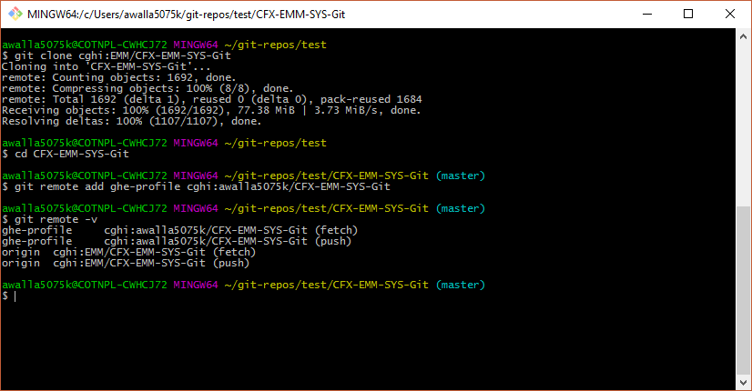
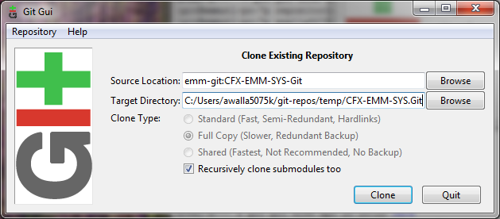

[index]

= Git User Guide

= Overview

This guide presents git usage per the GitFork workflow.

*Tips*
[TIP]
====
* https://www.atlassian.com/git/tutorials/comparing-workflows/forking-workflow[Forking Workflow] - Substitute *GitHub* for *Bitbucket* when reading this. Good explaination of this workflow.
* https://guides.github.com/activities/forking/[Forking Projects] a good introduction to GitHub forking.
* https://reflectoring.io/github-fork-and-pull/[Fork and Pull Workflow for Git Beginners]
====

The EM&M repositories (repos) are managed using the Comcast Enterprise https://github.comcast.com/[GitHub] system. It is based on the http://en.wikipedia.org/wiki/Git_(software)[Git] tool. Refer to http://git-scm.com/about[About Git] for more information on the Git tool.

GitHub has been configured for EM&M to use standard GitHub functionality to support collaboration. Specifically the https://help.github.com/articles/fork-a-repo/[GitHub fork] and https://help.github.com/articles/creating-a-pull-request/[pull request] functionality.

[NOTE]
====
The above links point to general open-source GitHub documentation. Comcast GitHub Enterprise is Comcast's GitHub with separate access management. **Do not use Comcast generated SSH keys to access the general open-source GitHub system.**
====

The primary deployment process reference is the Deployment https://wiki.sys.comcast.net/display/EMM/Workflow[WorkFlow] on the EM&M Configuration Management https://wiki.sys.comcast.net/pages/viewpage.action?pageId=48759751[(CM) Wiki]. Refer to ../plan[Configuration Management Plan] for related EM&M policies and guidelines.

This section of this manual has been designed to get up and running with the EM&M GitHub organizations repos for release management.

= New to Git?
If you are new to Git, watch the videos at https://www.git-scm.com/doc[Git Documentation]. The time required is less than 30 minutes. It's a great investment of your time.

The EM&M GitHub repos and access have been configured to use Github fork and Pull functionality. GitHub pull requests are required for the main branches.

This rest of this overview section covers the following:

* Identifies the *Prerequisites* that need to be addressed.
* Provides *Notes* on issues that have caused questions as this system has been rolled out and used.
* Outlines a typical *General Session* you are likely to encounter as you use and interact with the EM&M Git System.

= Prerequisites

Refer to the  https://wiki.sys.comcast.net/display/EMM/On-Boarding[On-Boarding] CM wiki page for details.

== Notes

. EM&M Git Modules are identified based on the EM&M https://wiki.sys.comcast.net/display/EMM/Module+Standards[Module Standards].
. You will need Write permission to be able to `Git push` to the remote (EM&M GitHub repo) *master*, *hotfix*, *release*, or *develop* branches. If you incorporate GitHub fork functionality, you can use GitHub "pull request" functionality with your team. Check with your DevLead for more details on this.
. Code reviews are required for all merges to develop and master branches. This is done with the *New pull request* button on the GHE repository home page.
. You must be a *developer lead* to `Git push`  to the remote (EM&M GitHub repo) *develop* and *master* branches.
. Note that a git tag that starts with *v[0-9]* is reserved for EM&M Production Releases. Reference the Release Branches section of this guide for details.
. For any git command, you can enter git [_command_] -h for command specific documentation.
. EM&M GitHub organization repo branch and tag access rules are configured and maintained at the GitHub organization level. Check with your EM&M Tower for details.
. Can't _git checkout_ to a new or different branch? Reference http://git-scm.com/book/en/v2/Git-Tools-Stashing-and-Cleaning[Stashing and Cleaning].
. Use *gitk* on your window git bash session for a good GUI of your current _**local**_ repo branching and merging picture.

= General Session

As development and unit testing occurs, most interaction with git will be through your local git repo on an isolated branch. The only times you will interact with the EM&M GitHub organizations will be when you:

. Request a new repo for the appropriate EM&M Comcast Enterprise GitHub organization.
. GitHub fork a repo from the EM&M GitHub organization to your github profile. Then "git clone" that repo to your workstation.
.. Add an additional "git remote" to your cloned repo for the organization repo you forked from.
.. If you have repo write permissions on the organization repo, you can clone directly from there by passing the GitHub fork functionality.
. Update your local repo from the EM&M GitHub organization repo.
. Update the EM&M GitHub repo from your local repo via your forked repo and your devlead.

Before you do any `git commit` on your local git repo, you need to:

. Establish a workstation local repo (`git clone` from your forked repo or clone directly from the organization repo if you have write permissions)
. Establish an additional git remote in your workstation local repo for the EM&M Comcast Enterprise GitHub organization repo.
. Identify available branches on local repo (`git branch`  -a)
. Establish working directory with appropriate branch head (`git checkout`  [_branch name_])
. Create new branch to code on (`git checkout`  -b [_new branch_])
. Update and/or establish *CHANGELOG* file. Reference _section 2.3.5 CHANGELOG_ of this manual.
. Update and/or establish .gitignore file. It Specifies intentionally untracked files to ignore. Reference http://git-scm.com/docs/gitignore[gitignore] and the https://wiki.sys.comcast.net/display/CEMP/Maven+Project+Configuration#MavenProjectConfiguration-GitPractices[Git Practices] section of the https://wiki.sys.comcast.net/display/CEMP/Maven+Project+Configuration[Maven Project Configuration] document for details.

= GitHub and Git Interfaces

When you followed the Git Installation Procedure previously for your workstation, the recommended Git Bash Command line Interface (CLI) and the Git Graphical User Interface (GUI) for your workstation were both installed.

Before using git locally on your system, you'll need to logon to your GitHub profile and select a repo:

image::images/github-profile.png[]

Fork the selected repo into your local github profile:

image::images/github-fork.png[]

== Delivery

Now you have a profile repo forked to your local profile. You will deliver your updates to this repo after you worked and tested them on the workstation repo you cloned from this repo. If you have Write permissions on the organization repo, you can clone directly from the organization repo and deliver there.

image::images/github-profile-repo.png[]

It is helpful to understand several Git _**command line**_ options before using the Git GUI. Following are examples of initial Git functionality using both the Git Bash and Git GUI tools.

Establish a Local Git cloned Repo, add remote for the GitHub Enterprise (ghe) profile repo you established previously:

== Using Git Bash:

image::images/GitBash.png[]

* Clone Existing Repository in a directory you establish for Git repos using *_git clone_*. Add additional remote for your GitHub profile copy of the repo. At this point you are ready to prepare updates and share your work in collaboration with your team.

* The *_git status_* command provides current status anytime you need it. It also recommends the next likely git commands you will use based on your current status.

[NOTE]
====
You must be local (In the directory) of a Git repo for *_git status_* to work correctly.
====

image::images/GitStatus.png[]

.Checkout a New Branch
* To identify and select a branch to work on:
** Identify available branches - *_git branch -a_*
** Select available branch to branch from - *_git checkout [any available branch]_*
** Create new branch based on selected branch *_git checkout -b [new branch name]_*

[NOTE]
====
. There is a * by the current local branch that is active
. Local branches are listed with branch name only
====

image::images/GitBashNewBranch.png[]

[IMPORTANT]
====
.The Git repo work area is composed of three components:
* The .git directory that contains all revisions and branches for the repo
* The local workarea directory that is initiated with the last commit of the current branch. Git considers these *Tracked* files.
* Files that have been added, modified, removed, or changed since the local workarea directory was initiated. Git considers these *Untracked* files. This set of deltas is being *Staged* for the next *Commit*. Once they are *committed*, they are considered *Tracked*.

Refer to https://git-scm.com/book/en/v2/Git-Basics-Recording-Changes-to-the-Repository[2.2 Git Basics - Recording Changes to the Repository]
====

image::images/GitBashStatus2.png[]

== Using Git GUI:

image::images/GitGUI.png[]

* Select *Clone Existing Repository*

image::images/CloneRepo.png[]

* For *Source Location* enter a EMM Git System repo prepended with _emm-git:_.
* For *Target Directory*, be sure you are identify a new non-existent directory. It's recommended you name the repo as it is named on the EMM Git System.
* Click on the *Clone* button

image::images/CloneInProgress.png[]

* When the clone is done, the Git GUI will be open in the cloned repo.

image::images/ClonedRepo.png[]

.Checkout a New Branch
* To identify and select a branch to work on:
** Select the Branch pulldown
** Select Create
** Select the Name: radio button, Name your branch in the window
** Select the Tracking Branch radio button
** Select the branch you wish to checkout
** Select checkbox *Detach From Local Branch*
** Click on the *Checkout* button

image::images/CheckoutBranch.png[]

* Your new branch is now _Checked out_.

image::images/CheckedoutNewBranch.png[]

At this point you have created a [feature branch] to code on. This can be done with the _Command Line Interface_ or with the GUI as indicated above.

If you are working on a JIRA ticket, your feature branch should be named according to the *_Development Deployment Branches_* section of this document.

After you have made some changes, i.e., creating new files, modifying existing files, and/or removing existing files, and done some testing you need to `git add` your changes so they can be staged for committing to your local feature branch repository. You may want to identify sub-sets of your changes for more testing scenarios. You can limit what you add to the staging environment for your next commit to accomplish this.

Use the `git status` command to keep track of what you have not added and what you have staged for the next commit to your feature branch. Use `git commit` to commit changes to your feature branch.

After each `git commit`  on your feature branch, check for conflicts with the [main branch] heads and outstanding release and hotfix branch heads. Repeat the
following for each of these branches. Ordering should be master, hotfix, release, develop. The more often you do this, the smaller the amount of potential conflicts:

* Update your local repo for any updates made by others (`git fetch` from the GitHub organization repo and other team profile repos)

[TIP]
====
Make note of new and updated branches
====

. For each new and updated branch execute the following on your feature branch:
** Merge branch (`git merge`  --no-ff [_branch name_])
. Note successful merge type and address any identified conflicts.

[NOTE]
====
. *Never code on main branches.*
. See the Git _Conflict Reporting section_ of the [EM&M Git Installation Procedure] for a tool that will identify all current conflicts in your local repo.
====

Now that you have confirmed your new changes do not conflict with any [main branch] heads or outstanding release branches, you are ready to push your changes up to the *EM&M GitHub repo* fork in your GitHub profile. While on your feature branch, execute the following:

. `git push ghe-profile` 

[NOTE]
====
. If you clone directly from your GitHub profile copy of the repo, the remote will be the default name of "origin". In this case _git push_ will be sufficient since it defaults to the "origin" remote.
. If your feature branch does not yet exist on the EM&M GitHub repo, the git push will respond with a command to establish your branch there. Cut and paste to use it.
. Only Developer leads can push the *develop* and *master* main branches on the EM&M GitHub organization repo.
====

For more details on working with EM&M GitHub Organizations, refer to the following:

* [EM&M General Git Approach] section of this document. 
* [First Git push] section of this document.

For a comparison of EM&M CVS usage and EM&M Git usage, review the [Git Compared to CVS] section of this document.

[NOTE]
====
This document refers to Git "Porcelain" commands that are build on the Git "Plumbing" commands. Reference http://git-scm.com/book/en/Git-Internals-Plumbing-and-Porcelain[Git Internals - Plumbing and Porcelain] for details.
====

== EM&M Modules in GitHub

In this organization, a Git repository *Module Name* consists of the following elements:

* *LOB* - Line of Business, one of CFX, DATA, VOICE, and VIDEO
* *Project* - Examples include AccountManagement, ADOPTOUT, AMDOCSOUT, ASTRO, AuditService, AUPM, AutoGen, BEACON, BlockingService, BPM, CANOE, CDV, CEMP, CIMCO, CLK, CloudUI, CMS, COLUMBUS, ContractAutomation, CPORTAL, CSG, CustMove, CycleChange, DDS, EEG, EEP, EEPBill, EMARS, EM&M, EST, FRAUD, HSD, HSI, IMS, ITV, JANUS, LCR, LDC, LEGAL, MANILA, NASR, NGT, ODS, OSM, PREPAID, RAZOR, SAP, SAVILLE, SDV, TVE, UES, UID, VAPI, VCME, VGD, VODGift, WaterMark, WHOLESALE, WIFI, WLS, XTM
* *AppType* - The type or class of application. Examples include SYS, MED, DIST, COLL, etc.
* *Application* - The name of the application. Examples include Git, OraBPM, Jenkins, Artifactory, etc.

[IMPORTANT]
====
* The *LOB* and *Project* values are required. 
* The *AppType* and *Application* provide further clarity and relationship indications such as dependencies.
====

== EM&M Git Functionality

EM&M uses the https://github.comcast.com/[Comcast Enterprise GitHub] system. GitHub is a http://www.saintsjd.com/2011/01/what-is-a-bare-git-repository/[bare git repository] implementation. The protocols established to transfer data between EM&M workstation git repos and the GitHub organizations repos established for EM&M Towers are:

* Dumb HTTP for read-only access via the GitHub website,
* Secure Shell (SSH) for read-write access.

Refer to https://git-scm.com/book/en/v2/Git-on-the-Server-The-Protocols[The Protocols] for details.

[NOTE]
====
The Git protocol is not used due to it's lack of authentication.
====

In order to execute the procedures in this section, you need have addressed all requirements in the _Prerequisites_ section in Chapter 1, the *Users Guide* of this manual.

== Request new repos for an EM&M GitHub Organization

The format of the Git module/repo name is as follows. Refer to the _EM&M Module Name_ section of the https://wiki.sys.comcast.net/display/EMM/Module+Standards[Module Standards] for details.

* *LOB-Project-AppType-Application*

.The EM&M organizations are been split into Towers. GitHub organizations have been configured based on EM&M. You'll also need to identify the GitHub tower to build this new repo in.  Your choices are as followings:
* EMM  _(Cross functional across all EMM towers)_
* EMM-Data
* EMM-ClickStream
* EMM-Prepaid
* EMM-Video
* EMM-Voice

Following the repo naming convention, Create a CM Team request ticket as follows:

This request is handled with an EM&M CM Team Support ticket as follows: (Address fields indicated below **ONLY**.)

. https://tpx.sys.comcast.net/secure/CreateIssue!default.jspa[dx Triple Play Tooling (TPT)]
.. Issue Type: Support
.. Click on Next button
.. Summary enter "Create New Repository" 
.. Add Watchers Robert Sell and Andrew Wallace 
.. EPIC Link: Operational request & support 2018
.. Description: Enter following modified for your request:
[source,asciidoc]
----
Create the following new Git repo/module(s).  The DevLead is FirstName LastName, userid NTLogon, unless otherwise indicated below with repo name:

LOB-Project-AppType-Application  (repeat this line as needed)

Build this new repo in GitHub organization (Choose from above list).
----
To open Ticket, Select *Create* button at bottom.

[NOTE]
====
These tickets are processed per CM Team priorities in order received.
====

== Change EM&M GitHub Organization Access

This can be done by your Tower leadership, specifically your devlead.

[TIP]
====
You can use Windows Explorer local to your ~/.ssh to attach your public key to the email.
====

[NOTE]
====
Sharing of repo branches in established EM&M GitHub profile repos is probably the easiest way for developers to share code.
====

== Copy an EM&M GitHub repo to your workstation

Copy an EM&M GitHub head of the default *master* branch to your local workstation.

Reference https://git-scm.com/docs/git-clone[git clone] or `git clone -h` for details.
[source,asciidoc]
----
 $ git clone cghi:[EMM org/][repo name]
----
Copy an EM&M GitHub repo to your workstation with workfiles set to the head of a given branch.
[source,asciidoc]
---- 
$ git clone -b [branch name] cghi:[EMM org/][repo name]
---- 

== Update local repo from the EM&M GitHub repo

Review http://gitref.org/remotes/[Sharing and Updating projects].
 
Reference `git fetch -h` or https://git-scm.com/docs/git-fetch[git fetch] for details.
[source,asciidoc]
----
$ git fetch
----

Reference `Git pull -h` or https://git-scm.com/docs/git-pull[git pull] for details. 
[WARNING]
====
this is a `git fetch` followed by a `git merge`.
====
[source,asciidoc]
----
$ git pull

----

== Update the EM&M GitHub repo from local repo

Push the branch head (latest `git commit`) of a new Git branch in the local Git repo on your workstation to the appropriate EM&M GitHub organization repo. The argument "--set-upstream" is required to initiate a new branch on the EM&M GitHub organization repo. 
[WARNING]
====
You must be a devlead to execute this command on the develop branch
====
[source,asciidoc]
----
$ git push --set-upstream origin [branch name]
----
Push the current branch head (latest `git commit`) in the local Git repo on your workstation to the EM&M GitHub organization repo.
[NOTE]
====
Requires local repo to have been setup with an origin remote that has *write* authority on the EM&M GitHub organization repo.
====
[source,asciidoc]
----
$ git push 
----

= Is this your First Git push?

Before executing a `git push` for a given EM&M GitHub organization repo, the following questions should help if you are having problems:

. Did you Review http://git-scm.com/book/en/Getting-Started-Git-Basics#The-Three-States[The Three States]?
. Are you familiar with the http://gitref.org/[Git Reference] site?
. Are you familiar with the http://emm-git1.sys.comcast.net/manual/manual.pdf#page=7&zoom=auto,56.692,500.997[EMM General Git Approach] section of this document?
. What `git branch`  are you attempting to update for the repo in question?
. What `git remote`  are you using for your `git push` ?
. Did you configure your [CHANGELOG] for the Development (*develop* branch)? (Branch entry in Build ID:)
. Did you develop on a [feature branch] and merge your changes to your development team’s [supporting branches] on the EM&M GitHub repo?
. Did you test and verify your `git merges`  on your local repo with the EM&M git repo master and develop branches before using `git push` to your development team’s EM&M GitHub repo [supporting branches]?
. Did you remove your [feature branch] once it was successfully merged to a development team [supporting branch]?
. Are you allowed to `git push` to the remote branch on the EM&M GitHub organization repo? 
. Note that the *develop* and *master* [main branches]on the EM&M GitHub organization repos have restrictions.

.The following utilities are available to you when considering the above questions. Be local to your repo on your workstation for the following “git” commands: 

Reports on current state of your local repo.
[source,asciidoc]
----
$ git status 
----
Lists the current branches in your git repo and any remote repos.
[source,asciidoc]
----
$ git branch -a 
----
Lists the configured remotes for your git repo. The `origin` remote is automatically setup for you when you create or acquire a git repo from the EM&M GitHub organization.
[source,asciidoc]
----
$ git remote -v
----
For your git repo origin remote, shows the git fetch and push URLs, tracked remote branches for your branches and branch push statuses.
[source,asciidoc]
----
$ git remote --v show origin
----

Did you review the http://emmutl-ch2-1p.sys.comcast.net/overview[Overview] page?

= EM&M Git System Workflow

The primary reference for EM&M Git documentation is http://git-scm.com/documentation[git-scm Documentation]. It is recommended you cover *Git Basics* and *Git Branching* at minimum. It is highly recommended you review the http://gitref.org[Git Reference] before moving further in this document. This review provides a basis of Git understanding that is assumed for the remainder of this User Guide.

In order to understand how branching and merging is utilized for the EM&M Change and Release Workflow review http://nvie.com/posts/a-successful-git-branching-model/[A Successful Git Branching Model by Vincent Driessen] in it's entirety. EM&M specifics are covered in following sections of this document.

The following diagram illustrates various situations that can occur at the same time. While reviewing this diagram, keep in mind there is also an understanding of multiples repos being involved. Most commonly, the local repo on your workstation, and the http://www.saintsjd.com/2011/01/what-is-a-bare-git-repository/[bare repo] on the Comcast Enterprize GitHub system.

Note the [Main Branches] *develop* and *master* provide for the ability to http://en.wikipedia.org/wiki/Vetting[vet] for conflicts after a `git commit`  occurs on any branch at any time.

Since git is a Distributed Version Control System (DVCS) this `vetting` can occur on the developers git repo without affecting the corresponding bare git repo on the _Comcast Enterprise GitHub_ system.  Each `git push` to the a GitHub repo branch must adhere to the following bullets to provide useful accurate vetting to developers:

* All know conflicts at the time of the commit to be pushed have been addressed
* The commit to be pushed represents a buildable set of code for all environments including upcoming production releases
* The commit to be pushed represents the code is deployable to all _deployed to_ environments including QA, Integration, Staging, and Production environments. Consider all environments copies of the cooresponding Production environment.

In order to provide for this vetting, all development is done on feature branches and merged to Main Branches with the merge adhering to the commit rules defined previously. If this cannot be followed, then the repo *develop* branch must be locked to ensure the commit rules defined previously are adhered to for follow-on release processing.

The GitHub system promotes this with required GitHub forks and pull requests accompanied by DevOps team code reviews.

The remainder of this document identifies the Distributed Workflow adopted and implemented for the EM&M organization. For more details, refer to http://git-scm.com/book/en/v2/Distributed-Git-Distributed-Workflows[Distributed Git - Distributed Workflows].

[NOTE]
====
. All merging occurs on client workstations, not the GitHub system other than controlled code reviews.
. EM&M developers and developer leads are responsible for managing merge conflicts.
. For good tips on git commit comments, See https://github.com/git/git/blob/master/Documentation/SubmittingPatches[Notes on Contributing Code] for the github git project.
. Review http://git-scm.com/book/en/v2/Distributed-Git-Contributing-to-a-Project#Commit-Guidelines[Commit Guidelines] to enhance team collaboration.
====

== The EM&M Branching and Merging Workflow

image::images/EMM-BranchingMerging-Workflow.png[]

=== Repository Branches

The first task is to create a feature branch that is copied from the latest commit of a main branch that is targeted for change. Before any change is introduced back into the EM&M GitHub organization controlled repo the user must merge their change into the appropriate Main Branches of their local git repo. This should be done after a `git fetch`  that brings down changes from the GitHub controlled repo. These changes would have been made since the last `git clone`  or `git fetch`  was performed on the local git repo. Module repo leads are assigned to aid users with these branching and merging tasks.

=== Main Branches

Main Branches are permanently maintained. Each `git push`  to a GitHub managed repo main branch is for code sets that build automatically. Development maintains the *develop* branch that is fully automated for builds and deployments to development environments. The Configuration Management and the Event Processing Assurance (EPA) teams maintain the *master* branch for production ready and production installed deployments.

The master branch is used to initialize *hotfix* branches. These *hotfix* branches are used to promote production problem related changes to the *master* branch and introduce these changes to the *develop* branch.

[IMPORTANT]
====
In the event of a LegacyProd-M.m branch, LP-hotfix-M.M-HF# branches by default will not merge into the *develop* branch.
====

The develop branch is used to initialize *release* branches. These *release* branches are used to promote releases delivered by development for promotion to QA/System Test, Integration, Staging, and Production environments.

"Merge Points" in EM&M GitHub organization repos are kept to a minimum to keep collaboration consistent and simple. The two main merge points provided for EM&M development by the EM&M GitHub organization repos are "Latest development" and "Latest Production". The "Latest Development" is buildable and deployable to the development environment. The "Latest Production" is the default branch (master) for production ready code.

The are two Main Branches in any given EM&M GitHub organization repo, *develop* and *master*. These branches are intended for deliverables that build and deploy in a automated fashion. In the case of the *develop* branch, each "git commit" and "git push" should automatically build and deploy to the development environment(s). For the *master* branch, each "git commit" and "git push" should automatically build and provide for "on demand" deployment to production environments. In addition, the *master* branch is only updated with "Production deployed" deliverables as determined from development and testing and production verification activities.  Supporting branches are used to manage branching and merging tasks performed before and between these Main Branches.

[NOTE]
====
. In "Git Speak", *origin* is associated with the EM&M GitHub organization repo.
. Each EM&M GitHub organization repo supports a single production installation. If multiple production installations are required for support purposes, additional master branches are maintained with the naming convention *LegacyProd-M.m*. These branches are maintained by the CM team with updates from development via HotFix supporting branches with the naming convention *LP-HotFix-M.m*.
====

The *develop* branch is the primary integration branch where automatic builds occur. The source code in the *develop* branch head is a stable point ready to be released. The *release* branches are established from the *develop* branch head. The *release* branch is used to prepare for the next production release. The *release* branch identifies code that development has deemed "Production Ready". The *master* branch is kept in sync with the latest production deployed release.

For more details, reference the [Branching and Merging] standards section of this manual.

=== Feature Branches
[source,asciidoc]
----
Should branch off from: develop
Must merge back into: develop
Branch naming convention: Change Record or User Story number with developer deployment tags, (see below), or temporary name. Never master, develop, release*, or hotfix\*
----
Feature branches (or sometimes called topic branches) are used to develop new features for the upcoming or a distant future release. When starting development of a feature, the target release in which this feature will be incorporated may well be unknown at that point. The essence of a feature branch is that it exists as long as the feature is in development, but will eventually be merged back into develop (to definitely add the new feature to the upcoming release) or discarded (in case of a disappointing experiment).

Feature branches typically exist in developer repos only, not in the EM&M GitHub organization repos unless being shared with the DevOps team. When merging a feature branch into the development branch, it must be coordinated with the assigned development lead.

==== Creating a feature branch

When starting work on a new feature, you can branch off from the develop branch as follows:

[source,asciidoc]
----
$ git checkout -b USfeature1 develop
Switched to a new branch 'USfeature1'
$
----

[NOTE]
====
If you are working on a JIRA ticket, the "USfeature1" branch is named with the format [UserStory]/[ModuleName]_N_N_N_N. The UserStory, ModuleName, and N values are found in the JIRA ticket summary field. Reference [Development Deployment Branches] for details.
====

==== Merging a feature branch

Finished feature branches must be merged into the develop branch in order to add them to the upcoming release. This is done by Development Leads.
[NOTE]
====
Developers can promote completed feature branches to Development lead repos or by promoting their feature branch to EM&M GitHub organization controlled repos. Reference `git remote`  and `git push`  for details.
====

[source,asciidoc]
----
$ git checkout develop
Switched to branch 'develop'
$ git merge --no-ff USFeature1
Merge made by the 'recursive' strategy.
 License    | 3 +++
 readme.txt | 2 ++
 test.rb    | 2 ++
 3 files changed, 7 insertions(+)
$ git branch -d USFeature1
Deleted branch USFeature1 (was 6786061).
$ git push origin develop
(summary of change)
$
----

The --no-ff flag causes the merge to always create a new commit object, even if the merge could be performed with a fast-forward. This avoids losing information about the historical existence of a feature branch. It groups together all commits that together added the feature.

Always delete feature branches once that have been successfully merged into a main branch.

[NOTE]
====
The following command can be to change the comment on the latest commit. Since the commment is part of the commit, a new commit is created with only the comment being changed.
[source,asciidoc]
----
$ git commit --amend
----
====

=== Development Deployment Branches

In this organization, development work requirements are done with Rally User Stories. These User Stories are associated with JIRA tickets that are maintained in the JIRA CEMPCM project workflow. The title of JIRA tickets is maintained in the summary field of the JIRA ticket with the Rally User Story number and the module release identifier. The Development Deployment Branch is a feature branch named with the UserStory and module release identifier, basically the JIRA summary field. The Module name is the repo name or one of many repos related to a given Module. It format is:

* [ModuleName]_N_N_N_N

The ModuleName format is as follows (Refer to the https://wiki.sys.comcast.net/display/CEMP/Module+Standards[EMM Module Standards] for details):

* LOB - Line of Business (CFX, DATA, VIDEO, VOICE).
* Project - Examples include AUPM, EST, UID, CDV. (Project Level)
* Apptype - Examples include MED, CON, COLL, CABS. (Application Group level)
* Application - Examples include Pub. (Application level)

[IMPORTANT]
====
*CVS to Git NOTES:*

* In the ModuleName the "_" is changed to the "-".
* The Product Line (Business Residential, one or the other or both) is being dropped.
* Modules are defined to a level where each module is a baseline deployment.
====

The http://en.wikipedia.org/wiki/System_of_record[source of record] for requirements is Rally. The *source of record* for deployments is the JIRA CEMPCM tickets. The *source of record* for code and related documents are the EM&M GitHub organization repositories.

When developers work on and deliver EM&M deployments for release outside of development to the QA, Integration, Staging, and Production environments, they do it with release-M.m branches.

When the release-M.n branch is buildable and deployable to the development environment, it is merged with the EM&M git system *Develop* branch. *This is a requirement for future build and deployment automation. It is also important to a DevOps culture.*

[IMPORTANT]
====
*NOTE:* Use `git log`  to verify the merged branch is identified. If not (didn't use arguments --no-ff on fast-forward merge) use the following command:
[source,asciidoc]
----
git commit --amend
----
This needs to be done right after the `git merge`  to include the name of the Development Deployment Branch found in the JIRA summary field.
====

The format of the developer deployment branch name is *[UserStory]/[ModuleName]_N_N_N_N* where each "N" is a nummeric increment for Major, Minor, Dev, Test. EM&M Intake system record numbers and Deployment branches are used to manage EM&M deployments from development, to QA, Test, and Production environments. The https://wiki.sys.comcast.net/display/CEMP/JIRA+EM&M+Workflow[EM&M Workflow] describes how this is managed.

The EM&M Module Release Tag identifies a specific Deployment set that is developed, tested, and released to EM&M QA, Test, and Production environments. Each number in the Module Release Tag has a specific meaning to identify specific set of elements in support of the EM&M Workflow for design, development, test, deploy, and production deployment.

* *Major* - A numeric integer used when tagging a module. A major module identifier typically indicates no backward compatibility with previous decremented major values. MAJOR version numbers are designed to be incremented for every full release of the module.

* *Minor* - A numeric integer that indicates a partial release to most recent MAJOR_MINOR release set. For example, release “2_22” would represent a delta that is added to release “2_21”. Dependency to the previous MINOR number with a common MAJOR version number is assumed. Any other dependencies are documented in the install or design documents by the developer.

* *DEV* - Numeric increment for each version of the MAJOR_MINOR release delivered by EM&M Development, initially set to “0” on first delivery of a Major_Minor identified module. If requirement change or development needs to deliver another version, this number is incremented, and the Test number is set to "0". Separate instructions from the install doc can be included with the build request for the QA environment. This would account for deltas that have changed since the QA install has already been done in the previous version.

* *Test* - Numeric increment for each version of the MAJOR_MINOR_DEV release delivered by EM&M Development, initially set to “0”.
If EM&M QA/Test drafts a defect for a MAJOR_MINOR_DEV_Test delivered and installed, the “Test” value is incremented by development for the next delivery addressing the defect. Separate instructions from the install doc can be included with the build request for the QA environment. This would account for deltas that have changed since the QA install has already been done in the previous version.

=== Release Branches
[source,asciidoc]
----
Should branch off from: develop
Must merge back into: develop and master
Branch naming convention: release-[Major].[Minor]
----

[NOTE]
====
Major and Minor as defined in the "Development Deployment Tags" section.
====

Release branches support preparation of a new production release. They allow for last-minute dotting of i’s and crossing t’s. Furthermore, they allow for minor bug fixes and preparing meta-data for a release (version number, build dates, etc.). By doing all of this work on a release branch, the develop branch is cleared to receive features for the next big release.

Release branches are what QA defects are written against. This is why developer feature branches for release branches are named with the JIRA ticket [UserStory]/[Module Name]_N_N_N_N format.

The key moment to branch off a new release branch from develop is when develop (almost) reflects the desired state of the new release. At least all features that are targeted for the release-to-be-built must be merged in to develop at this point in time. All features targeted at future releases may not---they must wait until after the release branch is branched off.

At the start of a release branch that the upcoming release gets assigned a version number based on the Major Minor values of the Development Deployment Tag acquired from the EM&M JIRA ticket. After the release branch is established the develop branch can now be updated with the next release. 

When merging a release branch into the development branch, it must be coordinated with the assigned development lead. When merging a release branch into the master branch, it is performed by the Configuration Management team, coordinated with the affected development leads, and coordinated with the EM&M release team and Comcast National Change Management (NCM) via an NCM CM and a EM&M "Go No Go" meeting.

[NOTE]
====
* The EM&M Tower DevLead establishes these branches on the EM&M GitHub organization repos making them available for developers to branch from.
* When developers branch from these release branches, their feature branch should be named according to the JIRA ticket [UserStory]/[module name]_N_N_N_N format.
* Developers merge the *develop* and *master* (and any other current release and/or hotfix) branches to their release feature branch before pushing these branches to the appropriate EM&M GitHub organization repo.
* The EM&M Tower DevLead merges developer prepared release feature branches to existing release branches.
* The EM&M CM Team merges the release branches to the *master* as releases are deployed and verified to production.
* The EM&M CM Team creates module repo tags (vM.m) after the deployment is verified in production.
* The development teams coordinates merging the release branch with the *develop* branch using comments in the associated JIRA ticket.
====

==== Creating a release branch

Release branches are created from the develop branch by the EM&M Tower DevLeads. For example, say version 1.1.HF5 is the current production release and we have a big release coming up. The state of develop is ready for release-1.2 as indicated by the M.m increments in the JIRA summary field.

[NOTE]
====
Optionally at the discretion of Project Management and Development, this could have ben release-2.0.
====

So the DevLead branches off the development branch and gives the release branch a name reflecting the new version number as indicated in the JIRA ticket:

[source,asciidoc]
----
$ git checkout -b release-1.2 develop
Switched to a new branch "release-1.2"
$ ./bump-version.sh 1.2
Files modified successfully, version bumped to 1.2.
$ git commit -a -m "Bumped version number to 1.2"
[release-1.2 74d9424] Bumped version number to 1.2
1 files changed, 1 insertions(+), 1 deletions(-)
$
----

After creating a new branch and switching to it, we bump the branch flag in the CHANGELOG. Here, bump-version.sh is a fictional shell script that changes some files in the working copy to reflect the new version. (This can of course be a manual change---the point being that some files change.) In this organization, this is done in the CHANGELOG file. Version numbers are established prior to development efforts and coordinated with the JIRA ticket. The bumped branch flag in the CHANGELOG is committed.

This new branch may exist there for a while, until the release is rolled out in the Production Environment. During that time, bug fixes may be committed to feature branches that are merged into in this release branch (as well as the develop branch).

[IMPORTANT]
====
Adding large new features here is strictly prohibited. They must be merged into the develop branch, and therefore, wait for the next scheduled release.
====

==== Merging a release branch

.When the state of the release branch is ready to become a real release and has been installed and verified in production, the following actions are carried out.
* First, the release branch is tagged with the appropriate vM.m tag merged into master, since every commit on master is a new release by definition. This is done by the EM&M CM team when closing a National Change Management release.
* Then the changes made on the release branch need to be merged back into the develop branch so that future releases will also contain any applied bug fixes. This is managed by the EM&M Tower DevLeads.
* This verification is recorded for future reference purposes in the appropriate JIRA delivery and Release tickets. When the Release is complete, the JIRA release ticket is referenced on the #emm-devops slack channel with a release completion announcement.

*The first two steps:*

*Tag*

[source,asciidoc]
----
$ git checkout release-1.2
git tag -a v1.2 -m 'Released to Production, verfied 26/Mar/17 9:09 AM. CEMPCM-1234'
git push origin v1.2
----

*Merge to master*
[source,asciidoc]
----
$ git checkout master
Switched to branch 'master'
$ git merge --no-ff release-1.2
Merge made by the 'recursive' strategy.
 License    | 3 +++
 readme.txt | 2 ++
 test.rb    | 2 ++
 3 files changed, 7 insertions(+)
$
----

*Push to GitHub*
[source,asciidoc]
----
git push
git push origin v1.2
----

The above commands are executed by the CM team after verifying the associated JIRA tag as been updated for the production deployment by the EM&M Tower DevOps team and verified in production by the developer. The tag comment is constructed with the JIRA ticket for future reference. This reference in turn provides all Change Record and Release Management references into JIRA and Rally.

[NOTE]
====
If you need to remove a tag for any reason in the EM&M Git System here are the commands:
[source,java]
----
git tag -d 12345
git push origin :refs/tags/12345
----
====

The release is now done, and tagged for future reference.
Edit: You might as well want to use the -s or -u <key> flags to sign your tag cryptographically.

To keep the changes made in the release branch, we need to merge those back into the develop branch:

[source,asciidoc]
----
$ git checkout develop
Switched to branch 'develop'
$ git merge --no-ff release-1.2
Merge made by recursive.
(Summary of changes)
$
----

This step may well lead to a merge conflict. If so, the Tower DevLead coordinates with development to fix and commit any merge conflicts found. This coordination between DevLeads and the development team is documented with comments in the associated JIRA ticket.

The release is now done and the release branch may be removed:

[source,asciidoc]
----
$ git branch -d release-1.2
Deleted branch release-1.2 (was 41a3f00).
$
----

=== Hotfix Branches
[source,asciidoc]
----
Should branch off from: master
Must merge back into: develop and master
Branch naming convention: hotfix-\[Major\].\[Minor\].\[HF#\]
----
[NOTE]
====
. If there is an active, in-progress release branch, merging should be considered depending on current state of major branches.
. HF# - HotFix number. The "#" increments for each hotfix of a given Major.Minor release.
====

Hotfix branches are very much like release branches in that they are also meant to prepare for a new production release, albeit unplanned. They arise from the necessity to act immediately upon an undesired state of a live production version. When a critical bug in a production version must be resolved immediately, a hotfix branch may be branched off from the corresponding tag on the master branch that marks the production version.

[IMPORTANT]
====
In the event of a LegacyProd-M.m master branch, the format of the Hotfix branch name is LP-hotfix-M.m.HF#.
====

The essence is that work of team members (on the develop branch) can continue, while another person is preparing a quick production fix.

Hotfix branches can have QA defects written against them. This is why developer feature branches for hotfix branches are named with the JIRA ticket [UserStory]/[Module Name]_N_N_N_N format.

When merging a hotfix branch into the development branch, it must be coordinated with the assigned development lead. When merging a hotfix branch into the master branch, it is performed by the Configuration Management team, coordinated with the affected development leads, and coordinated with the EM&M release team and Comcast National Change Management (NCM) via a NCM CM and a EM&M "Go No Go" meeting.  If there is a release branch in progress at the time the hotfix is merged into the master branch, the hotfix may also need to be merged into the release branch depending on the current release in progress circumstances.

[NOTE]
====
. The EM&M Tower DevLead establishes these branches on the EM&M GitHub organization repo making them available for developers to branch from.
. When developers branch from these hotfix branches, their feature branch should be named according to the JIRA ticket [UserStory]\[module name]_N_N_N_N format.
. Developers merge the *develop* and *master* (and any other current release and/or hotfix) branches to their hotfix feature branch before pushing these branches to the EM&M GitHub organization repo.
. The EM&M Tower DevLeads merge developer prepared hotfix feature branches to existing hotfix branches.
. The EM&M CM Team merges the hotfix branches to the *master* after releases are deployed to production.
. The EM&M CM Team creates module repo tags (vM.m) after the deployment is verified in production.
. The EM&M development DevOps teams coordinate merging the hotfix branch with the *develop* branch using comments in the associated JIRA ticket.
====

==== Creating the hotfix branch

Hotfix branches are created from the master branch. For example, say version 1.2 is the current production release running live and causing troubles due to a severe bug. The changes on the develop branch are currently unstable or too far ahead of the current production release 1.2. We may then branch off a hotfix branch from the master branch and start fixing the problem:

[source,asciidoc]
----
$ git checkout -b hotfix-1.2-hf1 master
Switched to a new branch "hotfix-1.2-HF1"
$ ./bump-version.sh 1.2-HF1
Files modified successfully, version bumped to 1.2-HF1.
$ git commit -a -m "Bumped version number to 1.2-hf1"
[hotfix-1.2-hf1 41e61bb] Bumped version number to 1.2-hf1
1 files changed, 1 insertions(+), 1 deletions(-)
$
----

[NOTE]
====
LegacyProd-M.m hotfix branches naming convention is:

* LP-hotfix-M.m-HF1
====

Don’t forget to bump the version number after branching off!

Then, fix the bug and commit the fix in one or more separate commits.

[source,asciidoc]
----
$ git commit -m "Fixed severe production problem(hotfix-1.2-HF1)"
[hotfix-1.2-HF1 cd3ebfe] Fixed severe production problem(hotfix-1.2-HF1)
 1 file changed, 1 insertion(+)
$
----

==== Merging the hotfix branch

When finished, the bugfix needs to be merged back into the *master* branch, but also needs to be merged back into the develop branch. This ensures the bugfix is included in the next release. This is completely similar to how release branches are finished.

[IMPORTANT]
====
The procedure followed for merging LP-hotfix-M.m branches are nearly the same. LegacyProd hotfix updates will most likely not be merged into the develop branch unless deemed necessary. 
====

First, tag the release and update master branch.

[source,asciidoc]
----
$ get checkout hotfix-1.2-HF1
$ git tag -a v1.2.HF1 -m "Released to Production, verfied 25/Mar/15 9:09 PM. CEMPCM-1234"
$ git checkout master
Switched to branch 'master'
$ git merge --no-ff hotfix-1.2-HF1
Merge made by the 'recursive' strategy.
 License | 1 +
 1 file changed, 1 insertion(+)
$ git push
$ git push origin v1.2.HF1
$
----

Edit: You might as well want to use the \-s or \-u <key> flags to sign your tag cryptographically.

Next, include the bugfix in develop, too:

[source,asciidoc]
----
$ git checkout develop
Switched to branch 'develop'
$ git merge --no-ff hotfix-1.2-HF1
Merge made by the 'recursive' strategy.
 License | 1 +
 1 file changed, 1 insertion(+)
$
----

The one exception to the rule here is that, when a release branch currently exists, the hotfix changes need to be merged into that release branch, instead of the develop branch. Back-merging the bugfix into the release branch will eventually result in the bugfix being merged into develop too, when the release branch is finished. (If work in the develop branch requires this bugfix and cannot wait for the release branch to be finished, you can merge the bugfix into the develop branch immediately.)

Finally, remove the temporary branch:

[source,asciidoc]
----
$ git branch -d hotfix-1.2-HF1
Deleted branch hotfix-1.2.1 (was cd3ebfe).
$
----

=== Change Tracking

In order to track and management change for the EM&M Organization, the following elements are used _end to end_ in the EMM Change Management process.

==== Release Tag

Release and HotFix branches are tagged at the time they are deployed to production and merged with the master branch for future historical reference purposes. These tags are used to identify Repo Releases made to Production Environments managed with the EMM Git System.

The components of the Release Tags are as follows:
[source,asciidoc]
----
vM.m - version, Major, Minor
----
Since the *ModuleName* and the repo name are synonymous and this tag is stored at the repo level, the release tag starts with a "v" indicating version of the repo.

*Major* - A numeric integer used when tagging a release. A major release identifier typically indicates no backward compatibility with previous decremented major values. MAJOR version numbers are designed to be incremented for identified full release.

*Minor* - A numeric integer used when tagging a minor release. A minor release identifier typically indicates backward compatibility with previous decremented minor values. MINOR version numbers are designed to be incremented for identified minor releases. 

==== HotFix Release Tag

The format is the same as the Release Tag with a "-HF#" Added to indicate a HotFix has been applied. The # is incremented for each HotFix applied to a given Release Tag.
[source,asciidoc]
----
vM.m-HF#
----
[NOTE]
====
A release tag composed of Major.Minor with no HotFix number indicates no HotFix has been applied.
====

==== Module Release ID

[source,asciidoc]
----
LOB-Project-AppType-Application_M_m_DevCount_QACount
----

This identifies a specific development delivery as it is managed through the https://wiki.sys.comcast.net/display/CEMP/JIRA+EM&M+Workflow#WorkFlow+Phases+by+Status+and+Process[EM&M Deployment Workflow]. 

The Rally User Story and Module Release ID for a given development/deployment effort are listed in the JIRA CEMPCM project ticket (issue) summary field.

The DevCount is incremented for each development delivery for QA deployment for the following development initiated changes. Examples include:

* Requirement Changes
* Changes made by development not related to any QA defects

The QACount is incremented for each development delivery for QA deployments that addresses any changes for installation, environment deployment issues, or functional issues encountered by CM, operations, or QA on previous development deliveries that have not been deployed to production environments.

Once a build/deployment in the QA environment is Certified by QA, the _Module Release ID_ is normally associated with the greatest Build Number (reference Build ID). 

==== Build ID

The Build ID is used to identify a specific set of deployable elements in the Artifactory system. It is composed of:

* The Module (or repo) name,
* following by the Major and Minor release numbers,
* Ending with the Build number as constructed by the EM&M Build System.  (Shown as # below)
[source,asciidoc]
----
ModuleName_M.m.#
----

The highest value _Build Number_ is associated with the latest or most recent available build/deployment for a give ModuleName_M.m release. This is what the Release Tag is associated to.

Refer to the following document sections for more details on Change Tracking:

* https://wiki.sys.comcast.net/display/CEMP/Version+Management+Implementation#VersionManagementImplementation-ModuleDeploymentPolicy[Module Deployment Policy]
* https://wiki.sys.comcast.net/display/CEMP/Version+Management+Implementation#VersionManagementImplementation-CHANGELOG[CHANGELOG]
* https://wiki.sys.comcast.net/pages/viewpage.action?pageId=227392710#EM%26MGitUsersGuide-DevelopmentDeploymentBranches[Development Deployment Branches]

== Quick References

=== Useful Command Syntax

After "git fetch origin", shows difference between master branch and branch on emm-git repository (origin).
[source,asciidoc]
----
git diff master origin/master
----
Report representation of current repo. (May need to send to tmp file to see full report - >> tmp.txt)
[source,asciidoc]
----
git log --pretty=oneline --graph --decorate
----
Visual representation of current repo.
[source,asciidoc]
----
gitk
----

h3. Cheat Sheets

Following are "Cheat Sheets" of tools you will use often in this environment:

=== Useful Links

* http://sethrobertson.github.io/GitBestPractices/[Commit Often, Perfect Later, Publish Once: Git Best Practices]
* http://git-scm.com/book/en/v2/Git-Basics-Undoing-Things#_undoing[Undoing Things]
* http://en.wikipedia.org/wiki/Git_(software)[Git Software]
* http://en.wikipedia.org/wiki/File:Git_operations.svg[Git Operations]
* http://gitref.org/[Git reference]
* http://tom.preston-werner.com/2009/05/19/the-git-parable.html[The Git Parable]
* http://ftp.newartisans.com/pub/git.from.bottom.up.pdf[Git from the bottom up]
* http://eagain.net/articles/git-for-computer-scientists/[Git for Computer Scientists]
* http://www.sbf5.com/~cduan/technical/git/[Understanding Git Conceptually]
* http://longair.net/blog/2009/04/16/git-fetch-and-merge/[git fetch and merge, don't pull]
* http://www.vogella.com/tutorials/Git/article.html[Git Tutorial]
* http://www.vogella.com/tutorials/EclipseGit/article.html[Eclipse Git Tutorial]
* http://rogerdudler.github.io/git-guide/[Git - The simple guide]
* http://www.cloudways.com/blog/managed-git-deployment/[Why Managed Git Deployment]
* https://support.cloudways.com/entries/69615887-Using-Git-for-Deployment-[Cloudways - Using Git for Deployment]

