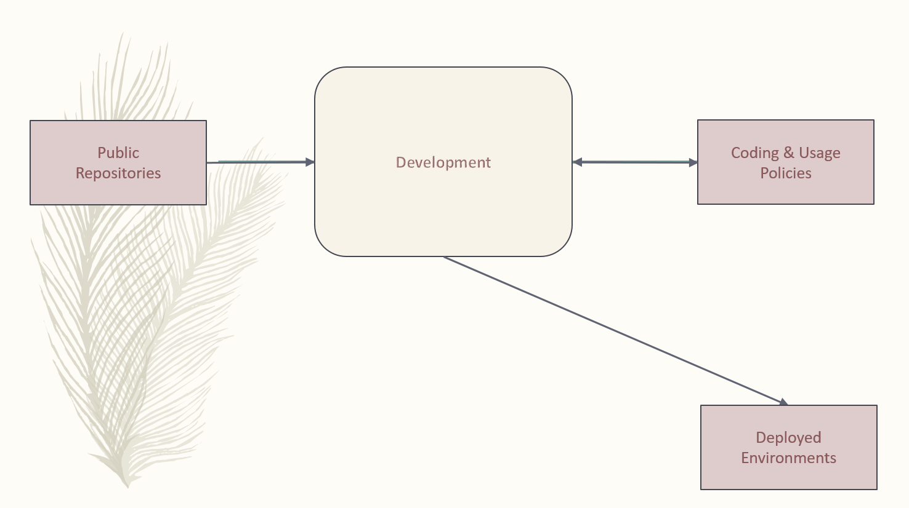
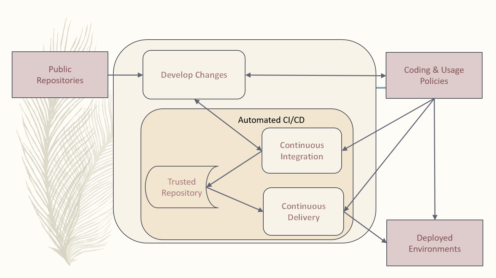
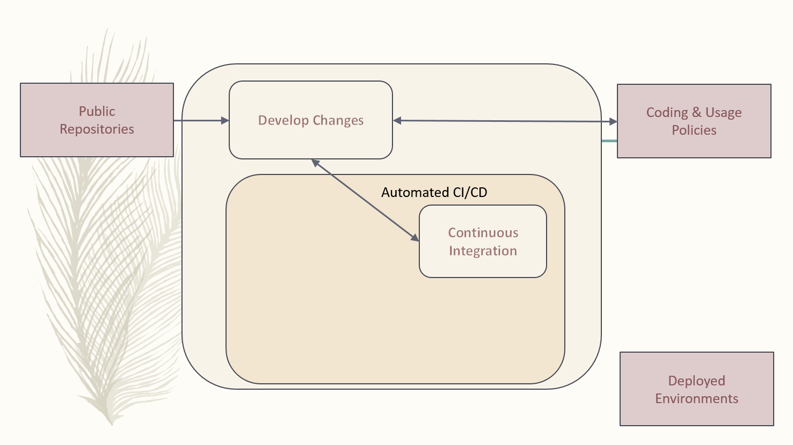
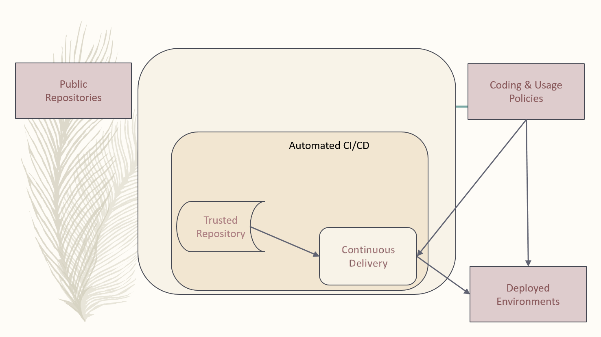
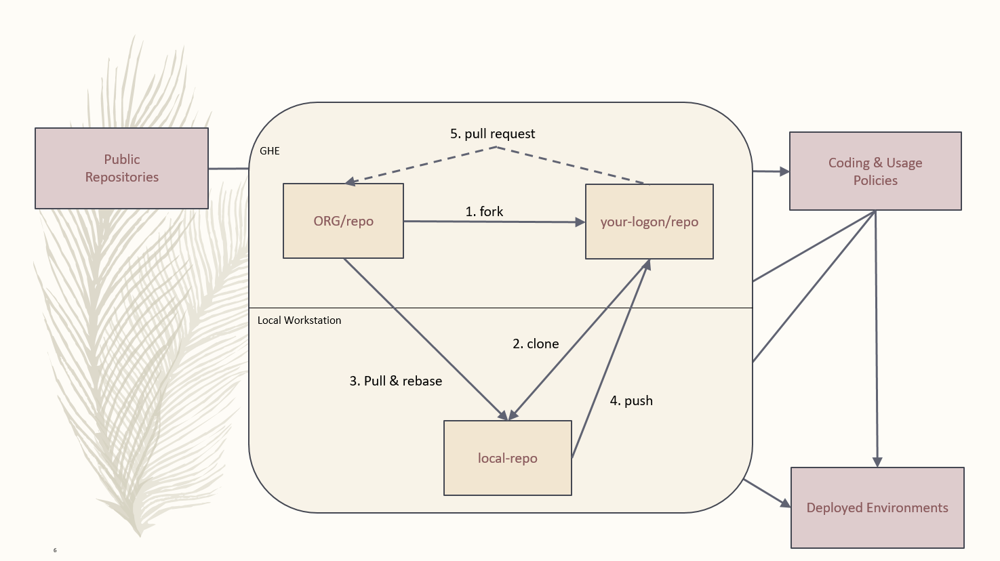

:toc2:
== Overview

A https://en.wikipedia.org/wiki/Software_development_process[Software Development Process] captured from historical industry practices and evolving modern approaches.  It's maintained as change is encountered and experienced in the IT industry.

.The purpose of the MDP is to encourage and support developers by:
* Separating Development from Operations
* Identifying Automation separately from Development and Operations

.The goals of this process include:
* Get more value to the market quicker
* Reduce risk
* Empower developers with ability to present all possibilities
* Promote an environment where developers can support any dx group
* Identify, develop, and maintain “Best Practices”

This process utilizes the https://www.atlassian.com/git/tutorials/comparing-workflows/forking-workflow[GitFork Workflow] which is built on the https://datasift.github.io/gitflow/IntroducingGitFlow.html[GitFlow Workflow].

This approach has been defined and proven in the open source development world.

== Context Diagram

=== Develop Changes

Developers are focused on development separately from Operations and https://en.wikipedia.org/wiki/Continuous_integration[CI] / https://en.wikipedia.org/wiki/Continuous_delivery[CD] automation. They work directly with *public repositories* and local code identifying best options for development requirements or “asks”.

During this DevOps process, development references and challenges *Coding & Usage Policies* per security, licensing, testing, and coding standards.

Development proceeds unencumbered with private, individual developer controlled forked repositories, separate from the automation of CI/CD and stability required for operations.

Developers are free and encouraged to expand and improve CI/CD automation. This includes building, testing, and operational environment challenges as they develop new functionality for customer solutions.

*_Code Reviews_* occur with Development Leads prior to initiating the Automated CI/CD.

== DevOps Process

[NOTE]
====
.NOTES:
* For the https://www.atlassian.com/git/tutorials/comparing-workflows/forking-workflow[GitFork workflow], Dev coding, testing, verifying, etc, happens between step 7 and 8.
* *Rebuild project/repository OFTEN. All repos including workareas are:*
** less stale
** Up to date
** More secure
* Project or repositories that are used by automated *_Continuous Integration_* are configured to promote code reviews and clean development baseline starting points. These are the repositories developers fork from.
* Developer forked repos can utilize CI and CD together to promote to a developer controlled environment. These type of pipelines are limited to a maximum set of versions in the *__Trusted Repository__* as they support development. Otherwise non-development pipelines end at the *__Trusted Repository__*.
====

=== Continuous Itegration

An automated process that should be initiated at the completion of a *_git push_* to the primary (non-forked) GHE repository *_develop_* branch.

The build of this process enforces and verifys the *_Coding & Usage Policies_*.

.Provides tested deployment sets to the *_Trusted Repository_*:
* All know tests, like code, are executed for every build prior to adding to Trusted Repo.
* This allows deployment environments, promoted to by *_Continuous Deliver_* to be focused on validation of new changes.
* Successful build identified with https://semver.org/[semantic versioning].

[NOTE]
====
.NOTE:
* Changes to this process are developed and tested in the *_Develop Changes_* process, subject to code reviews.
====

=== Trusted Repository

This is the end point of the *_Continuous Integration_* process and the starting point of the *_Continuous Delivery_* process.

In addition to updates made by the *_Continuous Integration_* process, *_Coding & Usage Policies_* can report on and remove elements as required.

=== Continuous Delivery

Provides deployments from the *_Trusted Repository_* for argument selected environments.

*_Coding & Usage Policies_* can report on and remove elements as required within this process.

[NOTE]
====
.NOTE:
* *_Coding & Usage Policies_* can report on and remove elements as required outside of the EMM DevOps Process.
====

== DevOps Developer

.For given “asks”, developer looks for and/or develops working solutions
* Identify/Establish repository or repo:
** From Public Repository or Team Repository or create new (Team repos available to CI process)
* Fork from existing projects or repositories for full development freedom:
** Forking Projects – (example using the spoon-knife project),
** Fork & Pull Workflow (For git beginners) 
* Clone from forked repo
* Create additional remote to non-forked repo
** NOTE: Rebuild local repo often, daily to start
* Verify Coding & Usage Policies:
** Report variance to customers
** Challenge security, licensing, testing, and coding standards as needed
* Prepare Changes:
** Test with all known CI process testing.  Add, modify, remove as needed.
* Commit and merge per GitFork workflow (Dev coding, testing, verifying, etc, happens between step 7 and 8)
* Initiate automated CI
** Push Changes to Non-Forked repository or project

== Continuous Integration Automated Process
image::images/ci-automated-process.png[]

.The Continuous Integration process is:
* Initiated by Developer with a repository push
* Automatically verified with existing “Coding & Usage Policies”
* Automatic Build
* Automatic Testing
* Build/Test reporting to development
* Successful build identified with https://semver.org/[semantic versioning]
* Successful build delivered to Trusted Repository

[NOTE]
====
.NOTE:
*_Coding & Usage Policies_* verification reporting is run against all elements in Trusted Repository on a regular basis.
====

== Continuous Delivery Automated Process

.The Continuous Delivery process:
* Starts with up-to-date, verified, built from a Trusted Repository 
* Contents included are delivered from CI automated process exclusively
* Uses Builds identified with https://semver.org/[semantic versioning]
* Automatically verified with existing “Coding & Usage Policies”
* Automatic environment deployment report
* Automatically deploys to specified environment

[NOTE]
====
.NOTE:
*_Coding & Usage Policies_* verification reporting is run against all "deployed to" environments on a regular basis.
====

== Fork Related Steps

[NOTE]
====
.NOTES:
* Developers may have multiple instances of the above development environment depending on the projects/repos they support.
* Code reviews initiated by contributing developers and managed by DevLeads are the gateway to controlled GHE repository updates and non-development CI initiation. 
* The use of forked repos only requires ready-only permission for contributing developers.
** Executing the http://emmutl-ch2-1p.sys.comcast.net/git/EMM-GitInstallationProcedure.adoc.html[Install git] procedure is required for this.
* The Develop Changes process is separate from:
** Automation:
*** CI
*** CD
** Operations
====

== References

* https://reflectoring.io/github-fork-and-pull/[Fork & Pull Workflow] For git beginners
* https://guides.github.com/activities/forking/[Forking Projects] – example using the https://github.com/octocat/Spoon-Knife[spoon-knife project]
* https://www.youtube.com/playlist?list=PL0lo9MOBetEHhfG9vJzVCTiDYcbhAiEqL[GitHub and Git Foundations (YouTube)]